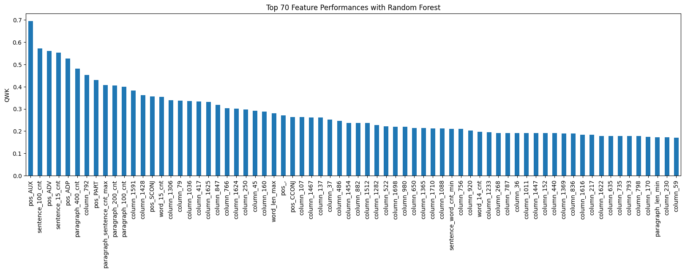

# VisionTasks

This repository contains competition solutions for two Kaggle competitions:
- **ISIC 2024** - Skin Cancer Detection with 3D-TBP
- **Learning Agency Lab** - Automated Essay Scoring 2.0

> **Note:** Original datasets are available on Kaggle. Augmented images and model weights are not included due to GitHub's file size limitations.

---

## ISIC Skin Cancer Detection

### Problem Statement
Develop image-based algorithms to identify histologically confirmed skin cancer cases using single-lesion crops from 3D Total Body Photos (TBP). Key challenges included:
- Low-resolution images
- Erroneous data (fixed later in the competition)
- **Severe class imbalance**: >99% of images belonged to the negative class

|  |  | |
|:------------------------------------------------:|:------------------------------------------------:|:--------------------------------------:|
| *Figure 1: Examples of the images provided*      | *Figure 2: Another example*                      |*Figure 3: Another*                              |

You can see that none of the images provided had resolution higher than 200x200. Thus it is not fitting to use the pretrained models directly since they are likely not trained on images of such low resolution.
### Approach

#### Data Augmentation
To address the extreme class imbalance, I used image augmentation to artificially increase positive samples. Given the generally low image quality, I avoided aggressive augmentation techniques to preserve diagnostic features.

|  |  | |
|:------------------------------------------------:|:------------------------------------------------:|:--------------------------------------:|
| *Figure 4: Example of augmented images*      | *Figure 5: Another example*                      |*Figure 6: Another*                              |

I mainly used color and geometric transformations that do not include shear and any other changes that might affect the original shape and porportion of the image provided.

#### Model Training
Fine-tuned seven vision transformer models on **8x A100 GPUs** (~10 hours total training time):

| Model | Batch Size |
|-------|------------|
| `google/vit-base-patch16-224` | 32 |
| `facebook/deit-base-distilled-patch16-224` | 32 |
| `microsoft/cvt-13` | 32 |
| `facebook/dino-vitb16` | 32 |
| `openai/clip-vit-base-patch32` | 16 |
| `timm/vit_small_patch16_224` | 64 |
| `facebook/vit-mae-base` | 16 |

#### Architecture
The fine-tuned vision models serve as **image encoders**, extracting visual embeddings from input images. These embeddings convert the problem into a tabular learning task, enabling experimentation with ensemble methods and boosting models for fast training and inference. We also tried RAPIDs SVR, which was very efficient.

### Future Improvements
- **Explore lighter models**: ViT inference is computationally expensive; investigate more efficient architectures
- **Try LibAUC**: Experiment with [LibAUC](https://libauc.org/) optimization library, which aligns with the competition's evaluation metric

---
## Automated Essay Scoring 2.0

### Problem Statement
Develop automated scoring systems for student essays using natural language processing and machine learning techniques.

### Approach

#### Feature Engineering

Extensive feature engineering was performed across three main categories:

**1. Basic Text Statistics**
- Paragraph count by length categories
- Sentence count by length categories  
- Statistical measures (mean, median, standard deviation) of sentence and paragraph lengths

**2. Readability & Linguistic Metrics**
Calculated 15 readability scores using the `textstat` library:
- Flesch-Kincaid Grade Level
- Gunning Fog Index
- Coleman-Liau Index
- Automated Readability Index
- Flesch Reading Ease
- Linsear Write Formula
- SMOG Index
- Dale-Chall Readability Score
- Difficult Words Count
- Fernandez Huerta
- Szigriszt-Pazos
- Gutierrez Polini
- Crawford
- Gulpease Index
- Osman

**3. Grammar Analysis**
Implemented Levenshtein distance features (credit: TheItCrow) comparing original essays to LLM-corrected versions. While the LLMs didn't catch all grammatical errors, these features proved valuable for model performance.

#### Feature Selection

Many linguistic features exhibited high correlation, which is detrimental to classical machine learning performance. Applied multiple feature selection techniques:
- **Lasso Regression** for feature importance
- **Random Forest** for feature ranking  
- **PCA Decomposition** for dimensionality reduction

  
   
  <em>Figure 1: Most important features found with Lasso Regression</em>

  
   
  <em>Figure 2: Most important features found with Random Forest.</em>

  
   
  <em>Figure 3: The PCA Components </em>

Removed highly correlated features and retained only the most predictive ones.

#### Language Model Embeddings

Used six pre-trained language models to extract linguistic embeddings from essays:

| Model | Batch Size |
|-------|------------|
| `google/vit-base-patch16-224` | 64 |
| `facebook/deit-base-distilled-patch16-224` | 64 |
| `microsoft/cvt-13` | 64 |
| `facebook/dino-vitb16` | 64 |
| `facebook/vit-mae-base` | 32 |

> **Note:** Unlike the ISIC competition, these models were **not fine-tuned**. Pre-trained LLMs already handle general writing well, unlike medical images which require domain-specific adaptation.

#### Ensemble Modeling

Concatenated LLM embeddings with filtered engineered features to create a rich tabular dataset. Trained an ensemble of:
- Boosting models (XGBoost, LightGBM, CatBoost)
- Support Vector Regression (SVR)

All models have their hyperparameters optimized with Optuna

**Key:** Implemented threshold fitting to map continuous predictions to discrete score classes based on the training set, which significantly improved performance.

### Future Improvements
- **Fine-tune fewer, better models**: Prioritize quality over quantity, especially given efficiency requirements
- **Experiment with pseudo-labeling**: Use model predictions on unlabeled data for semi-supervised learning
- **Apply quantization**: Reduce model size and inference time through INT8/FP16 quantization

---

**The approaches for both competitions are heavily inspired and influenced by [Chris Deotte](https://www.kaggle.com/cdeotte). His community posts taught me a lot.**